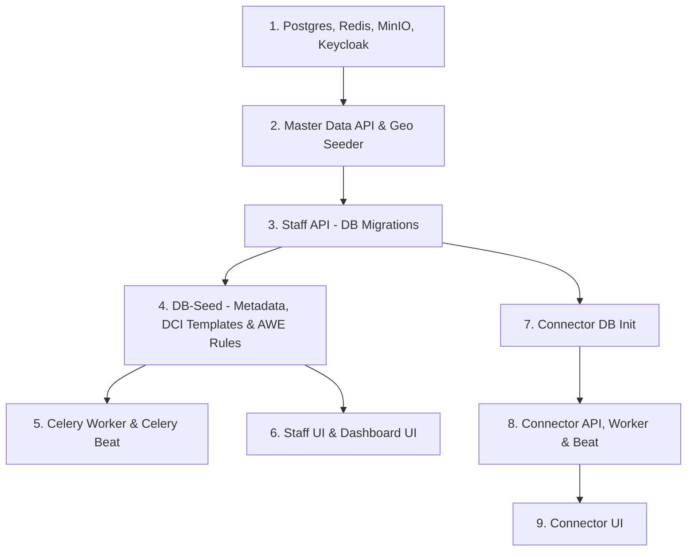

# OpenG2P Gen2 Livestock Registry & Connector — DevOps Staging & Production Deployment Guide

> **Audience**: Platform, DevOps, and backend developers deploying the OpenG2P Livestock Registry stack (`openg2p-livestock-registry`, `openg2p-connector-service`, `openg2p-connector-ui`, and ODK ingestion pipelines) to staging and production environments.  
> **Target Scope**: End-to-end deployment, container builds, configuration drift prevention, runtime verification, rollbacks, and incident-grounded troubleshooting.  
> **Repository Grounding**: Values and specifications are extracted directly from `docker-compose.yml`, Dockerfiles, `deploy.env.example`, `.env.example`, `helm/openg2p-livestock-registry/`, `deploy/charts/openg2p-connector/`, and Jenkins pipelines.

---

## 1. Prerequisites & Infrastructure Topology

### 1.1 Required Services & Exact Pinned Versions

The Livestock Registry connector and core platform depend on shared foundation infrastructure (`commons-base` and `commons-services`). Deployments must pin exact upstream tags to prevent contract drift:

| Component / Service | Exact Pinned Version / Tag | Sourced From | Purpose |
|---|---|---|---|
| **PostgreSQL** | `postgres:16` | `docker-compose.yml` (`services.postgres`) | Primary datastore for `livestock`, `master_data`, `iam`, `keycloak`, `connector`, `awe` |
| **Redis** | `redis:7-alpine` | `docker-compose.yml` (`services.redis`) | Celery message broker (DB `0`: IAM/Registry Celery, DB `1`: Connector Celery) |
| **MinIO API & Console** | `minio/minio:latest` | `docker-compose.yml` (`services.minio`) | S3-compatible storage for Jinja2 templates (`templates`) and documents (`documents`) |
| **MinIO Client CLI** | `minio/mc:latest` | `docker-compose.yml` (`services.minio-init`) | Idempotent bucket initialization (`default`, `templates`, `documents`) |
| **Keycloak IAM** | `quay.io/keycloak/keycloak:24.0.4` | `docker-compose.yml` (`services.keycloak`) | OIDC Identity Provider managing staff users, groups, and realm roles |
| **IAM Staff API** | `openg2p/iam-staff-portal-api:1.4.0` | `local/.env.example` (`IAM_IMAGE`) | Staff authentication gateway, session cookie management, and RBAC mapping |
| **Master Data API** | `openg2p/master-data-api:1.1.0` | `local/.env.example` (`MASTER_DATA_IMAGE`) | Administrative hierarchy (`level-region`, `level-zone`, `level-woreda`, `level-kebele`) |
| **ID Generator** | `openg2p/openg2p-id-generator:1.1.2` | `local/.env.example` (`IDGEN_IMAGE`) | Functional ID generation engine for livestock ear tags and registration IDs |
| **Approval Workflow Engine (AWE)** | `openg2p/openg2p-awe:1.2.2` | `docker-compose.yml` (`services.awe`) | Multi-tier approval ladder orchestration (Kebele $\rightarrow$ Woreda $\rightarrow$ Zone $\rightarrow$ Region) |
| **AWE Admin UI** | `openg2p/openg2p-awe-ui:1.2.2` | `docker-compose.yml` (`services.awe-ui`) | Administrative console for inspecting approval workflows and execution logs |
| **Registry Platform Base** | `0.0.0-develop.296` | `local/.env.example` (`RP_VERSION`), `Chart.yaml` | Base image lineage for `staff-api`, `partner-api`, `celery`, `db-seed`, `staff-ui` |
| **Connector Service Runtime** | `python:3.10-slim` | `openg2p-connector-service/Dockerfile` | Python ASGI runtime running FastAPI (`8050`), Celery Worker, and Celery Beat |
| **Connector UI Runtime** | `node:20-alpine` $\rightarrow$ `nginx:1.27-alpine` | `openg2p-connector-ui/Dockerfile` | Vite React frontend packaged onto Nginx (`8080`) reverse-proxying API paths |
| **Postgres Client Init** | `jbergknoff/postgresql-client:latest` | `openg2p-connector/values.yaml` | Helm init container verifying Postgres TCP readiness before launching workloads |

> [!IMPORTANT]
> **PostgreSQL Connection Limits**: The platform's Python backend services (`staff-api`, `partner-api`, and two `celery` daemons) each allocate connection pools sized for production, consuming ~90 connections out of PostgreSQL's default 100 limit. In any shared container or standalone Postgres instance, `max_connections` **must be set to at least 200** (`command: ["postgres", "-c", "max_connections=200"]`). Omitting this causes immediate connection rejection error `53300: remaining connection slots are reserved for non-replication superuser connections`.

---

### 1.2 Environment Variables Matrix

Every variable required by the Connector and Registry stacks is listed below. Variables marked **SECRET** must never be committed to git or stored in plain-text configuration maps.

#### Connector Service (`openg2p-connector-service`)
| Variable Name | Default / Example Value | Classification | Description & Scope |
|---|---|---|---|
| `CONNECTOR_APP_HOST` | `0.0.0.0` | Safe Default | Network bind address for the FastAPI process |
| `CONNECTOR_APP_PORT` | `8050` | Safe Default | Port exposed by `connector-api` |
| `CONNECTOR_LOG_LEVEL` | `INFO` | Safe Default | Logging level (`DEBUG`, `INFO`, `WARNING`, `ERROR`) |
| `CONNECTOR_DB_DRIVER` | `postgresql+asyncpg` | Safe Default | Async SQLAlchemy engine driver |
| `CONNECTOR_DB_HOSTNAME` | `postgres` / `commons-postgresql` | Safe Default | Database hostname or cluster service DNS |
| `CONNECTOR_DB_PORT` | `5432` | Safe Default | PostgreSQL port |
| `CONNECTOR_DB_DBNAME` | `connector` / `nsr_connector` | Safe Default | Connector operational database name |
| `CONNECTOR_DB_USERNAME` | `connector_user` / `nsr_connector_user` | Safe Default | Connector database username |
| `CONNECTOR_DB_PASSWORD` | `change-me` | **SECRET** | Password for the connector database user |
| `CONNECTOR_PARTNER_INGEST_BASE_URL` | `http://partner-api:8000` | Safe Default | **Base URL only** of OpenG2P Partner API. Do not append `/partner/ingest_data` |
| `CONNECTOR_PARTNER_INGEST_TIMEOUT` | `30` | Safe Default | HTTP POST timeout (seconds) for ingestion dispatch |
| `CONNECTOR_CELERY_BROKER_URL` | `redis://redis:6379/1` | Safe Default | Redis connection string for Celery message broker (use Redis DB `1`) |
| `CONNECTOR_CELERY_RESULT_BACKEND` | `redis://redis:6379/1` | Safe Default | Redis connection string for Celery result backend |
| `CONNECTOR_WEBHOOK_DEFAULT_SECRET` | None | **SECRET** | Global fallback secret for authenticating inbound push webhooks |
| `CONNECTOR_WORKER_MAX_ATTEMPTS` | `5` | Safe Default | Maximum retry attempts for failed polling/ingestion tasks |
| `CONNECTOR_GLOBAL_MAX_IN_FLIGHT` | `50` | Safe Default | Global concurrency ceiling for simultaneous connector runs |
| `CONNECTOR_STORE_RUN_PAYLOADS` | `false` | Safe Default | Whether to store full JSON payloads in database run history (`false` in prod) |
| `CONNECTOR_RUN_PAYLOAD_MAX_BYTES` | `262144` | Safe Default | Maximum byte limit per recorded run payload (256 KB) |
| `CONNECTOR_VALIDATE_MAPPED_PAYLOAD`| `false` | Safe Default | Enforces schema validation against intermediate payload mappings |
| `CONNECTOR_CORS_ORIGINS` | `*` (dev) / `https://connector.*` | Safe Default | Allowed CORS origins for browser API access |
| `CONNECTOR_STRICT_INCREMENTAL` | `true` | Safe Default | Blocks full syncs when source incremental tokens/state are missing |
| `CONNECTOR_FULL_SCAN_ON_INCREMENTAL_UNSUPPORTED` | `false` | Safe Default | Rejects full scans if an endpoint does not support incremental filters |
| `CONNECTOR_METRICS_ENABLED` | `false` | Safe Default | Exposes Prometheus `/metrics` (requires `CONNECTOR_PIP_EXTRAS=metrics`) |
| `CONNECTOR_MASTER_DATA_DB_DSN` | None | **SECRET** | Optional asyncpg DSN to `master_data` DB for dynamic UI dropdowns |
| `CONNECTOR_REGISTRY_DB_DSN` | None | **SECRET** | Optional asyncpg DSN to `livestock` DB for dynamic UI dropdowns |

#### Connector UI (`openg2p-connector-ui`)
| Variable Name | Default / Example Value | Classification | Description & Scope |
|---|---|---|---|
| `VITE_CONNECTOR_API_BASE_URL` | `""` (empty string) | Safe Default | When empty, UI proxies `/connectors`, `/runs`, `/dlq` through Nginx/Vite |
| `VITE_DEV_CONNECTOR_PROXY_TARGET` | `http://127.0.0.1:8050` | Safe Default | Proxy target used strictly during local `npm run dev` |

#### Livestock Registry Stack (`livestock-registry/local/.env.example`)
| Variable Name | Default / Example Value | Classification | Description & Scope |
|---|---|---|---|
| `RELEASE_NAME` | `livestock` | Safe Default | Release identifier prefix |
| `RP_VERSION` | `0.0.0-develop.296` | Safe Default | Platform base version pin across all custom images |
| `COOKIE_DOMAIN` | `localtest.me` / `oanstaging.com` | Safe Default | Top-level domain for shared auth session cookies |
| `STAFF_UI_HOST` | `portal.localtest.me` | Safe Default | Browser-facing domain for Staff Portal UI |
| `STAFF_UI_PORT` | `3000` | Safe Default | External published port for Staff Portal UI |
| `POSTGRES_PASSWORD` | `postgres` | **SECRET** | Root password for PostgreSQL |
| `KEYCLOAK_ADMIN_PASSWORD` | `admin` | **SECRET** | Keycloak master administrator password |
| `KEYCLOAK_DB_PASSWORD` | `keycloak_pass` | **SECRET** | Password for `keycloak` database user |
| `IAM_DB_PASSWORD` | `iam_pass` | **SECRET** | Password for `iam` database user |
| `IAM_CLIENT_SECRET` | `staff-portal-secret` | **SECRET** | Shared client secret between IAM and Keycloak |
| `AUTH_CLIENT_SECRET` | `livestock-staff-portal-secret` | **SECRET** | OIDC secret for `livestock-staff-portal` client |
| `MASTER_DATA_DB_PASSWORD` | `master_data_pass` | **SECRET** | Password for `master_data` database user |
| `IDGEN_DB_PASSWORD` | `livestock_idgenerator_pass` | **SECRET** | Password for `livestock_idgenerator` user |
| `REGISTRY_DB_PASSWORD` | `livestock_pass` | **SECRET** | Password for `livestock` registry database user |
| `MINIO_ROOT_USER` | `minioadmin` | Safe Default | MinIO object storage admin user |
| `MINIO_ROOT_PASSWORD` | `minioadmin` | **SECRET** | MinIO object storage admin password |
| `AWE_CALLBACK_HMAC_SECRET` | `awe-hmac-secret` | **SECRET** | HMAC secret used to verify webhook decisions from AWE |
| `APPROVER_RESOLVER_SECRET` | `approver-resolver-secret` | **SECRET** | Shared secret between AWE approver rule and `/livestock/approver-resolver` |

---

### 1.3 Access & Credentials Acquisition

1. **Container Registry (ECR / Docker Hub)**:
   * CI/CD images are pushed to AWS ECR (`${AWS_ACCOUNT_ID}.dkr.ecr.ap-south-1.amazonaws.com/openg2p/livestock-registry/*`).
   * Developers pushing manually require AWS IAM credentials with `ecr:GetAuthorizationToken`, `ecr:BatchCheckLayerAvailability`, and `ecr:PutImage`:
     ```bash
     aws ecr get-login-password --region ap-south-1 | \
       docker login --username AWS --password-stdin ${AWS_ACCOUNT_ID}.dkr.ecr.ap-south-1.amazonaws.com
     ```
2. **Keycloak Realm Administration**:
   * Initial realm definition is mounted from `local/keycloak/realm-staff.json` into `/opt/keycloak/data/import/realm-staff.json`.
   * Web console access: `http://keycloak.localtest.me:8080/admin` (Local) or `https://keycloak.<domain>/admin` (Staging).
   * Credentials: username `admin`, password `${KEYCLOAK_ADMIN_PASSWORD}`.
3. **Database Credentials**:
   * Local compose loads initial user roles via `local/postgres/init.sql` and `local/postgres/init_connector.sql`.
   * Staging/production credentials: **OPEN — TBD by infra/DevOps owner** (managed via Kubernetes Secrets / HashiCorp Vault / Cloud IAM).
4. **ODK Central Access**:
   * Canonical URL, project credentials, and service tokens: **OPEN — TBD by infra/DevOps owner**.

---

## 2. Image Build Pipeline & Code Patches

### 2.1 Connector Build Commands

#### Connector Service (`openg2p-connector-service`)
The service image packages FastAPI, Celery Worker, and Celery Beat into a single container controlled by `docker-entrypoint.sh`:

```bash
# Standard image build
docker build -t openg2p/openg2p-connector-service:latest ./openg2p-connector-service

# Production build with Prometheus metrics & Kafka extras enabled
docker build \
  --build-arg CONNECTOR_PIP_EXTRAS=metrics,kafka \
  -t openg2p/openg2p-connector-service:latest \
  ./openg2p-connector-service
```

#### Connector UI (`openg2p-connector-ui`)
Multi-stage build compiling TypeScript/React via Vite and serving static assets through Nginx:

```bash
docker build -t openg2p/openg2p-connector-ui:latest ./openg2p-connector-ui
```

---

### 2.2 Livestock Registry Images Build Commands

When building custom domain images for the registry, **always append `--no-cache`**. The CI/CD pipeline (`livestock-registry/Jenkinsfile`) strictly enforces this:

```bash
cd livestock-registry

# Staff Portal API
docker build --no-cache --build-arg RP_VERSION=0.0.0-develop.296 \
  -f docker/staff-api/Dockerfile -t openg2p/openg2p-livestock-registry-staff-api:0.0.0-develop.296 .

# Partner API (Data Ingestion)
docker build --no-cache --build-arg RP_VERSION=0.0.0-develop.296 \
  -f docker/partner-api/Dockerfile -t openg2p/openg2p-livestock-registry-partner-api:0.0.0-develop.296 .

# Celery Worker & Beat
docker build --no-cache --build-arg RP_VERSION=0.0.0-develop.296 \
  -f docker/celery/Dockerfile -t openg2p/openg2p-livestock-registry-celery:0.0.0-develop.296 .

# Database Seeder & Migrator
docker build --no-cache --build-arg RP_VERSION=0.0.0-develop.296 \
  -f docker/db-seed/Dockerfile -t openg2p/openg2p-livestock-registry-db-seed:0.0.0-develop.296 .

# Staff Portal UI
docker build --no-cache --build-arg RP_VERSION=0.0.0-develop.296 \
  --build-arg DASHBOARD_URL=http://dashboard.localtest.me:3001 \
  -f docker/staff-ui/Dockerfile -t openg2p/openg2p-livestock-registry-staff-ui:0.0.0-develop.296 .

# Livestock Analytics Dashboard UI
docker build --no-cache \
  --build-arg NEXT_PUBLIC_PORTAL_URL=http://portal.localtest.me:3000 \
  -f docker/dashboard-ui/Dockerfile -t openg2p/openg2p-livestock-registry-dashboard-ui:0.0.0-develop.296 .
```

---

### 2.3 Build-Time Code Patches (Technical Audit & Rationale)

> [!CAUTION]
> **Mandatory Patch Removal Rule**: Before removing any patch script or `sed`/substitution step from a Dockerfile, the version mismatch or architectural limitation it compensates for **must be re-verified as resolved against the CURRENTLY pinned image tags on both sides** (e.g. `openg2p-registry-staff-ui` and `master-data-api`). Never remove a patch based on an unverified assumption or an outdated comment claiming it is "no longer needed." Doing so has historically broken production dropdowns and intake ingestion.

#### 1. Staff UI Patches (`livestock-registry/docker/staff-ui/`)
* **Background Photo Override & Cache-Busting (`Dockerfile: lines 56-80`)**:
  * *What*: Injects `background-size: cover` CSS rules targeting `bg_pattern` and appends `docker/staff-ui/assets/overrides.css`. Renames the resulting compiled CSS file from `<hash>.css` to `<hash>ls<md5>.css` and rewrites all Next.js bundle references.
  * *Why*: The platform Next.js bundle hardcodes tiled pattern backgrounds. Compiled stylesheets are served with `Cache-Control: immutable, max-age=1y`. Appending styles without renaming the file leaves client browsers permanently caching the unpatched asset.
* **Dashboard Header Navigation (`docker/staff-ui/assets/patch-dashboard-nav.js`)**:
  * *What*: Injects a Next.js navigation button pointing to `DASHBOARD_URL` immediately to the left of the "Configuration" menu.
  * *Why*: The Staff Portal is distributed as a compiled application bundle that does not support runtime route extensions.
* **Dialog Table Cascades (`docker/staff-ui/assets/patch-dialog-overlay.js` & `livestock-dialog-overlay.js`)**:
  * *What*: Injects a `<script defer>` bundle into HTML headers restoring Species $\rightarrow$ Breed filtering, ear tag autocompletion, and Vaccine-by-Species filtering.
  * *Why*: Upstream `staff-ui` table dialog popups cannot natively execute cross-column cascades.
* **Attribute Value Route Forwarding (`docker/staff-ui/assets/patch-attribute-value-routes.js`)**:
  * *What*: Modifies Next.js API proxy routes for attribute values to forward `interval_days`, `is_active`, `notes`, `requires_ear_tag`, and `is_flock_species`.
  * *Why*: The base image routes rebuild payloads from a hardcoded whitelist, silently stripping custom domain fields before reaching the backend.
* **File Import Document ID Fix (`docker/staff-ui/assets/patch-enqueue-import-route.js`)**:
  * *What*: Patches the file import submission handler to forward `document_id` instead of only `document_store_id`.
  * *Why*: The backend registry API strictly requires `document_id`; without this patch, File Imports abort with 422 errors.
* **"Sort Order" Label Rename (`Dockerfile: lines 132-157`)**:
  * *What*: Replaces `"sort_order":"Sort Order"` with `"sort_order":"Display Order"` across compiled JSON translation chunks.
  * *Why*: Resolves user confusion regarding the functional purpose of the attribute ordering field.

#### 2. Staff API Core Patches (`livestock-registry/docker/staff-api/core-patches/apply_patches.py`)
* **Cross-Attribute Parent Hierarchy (Fix 1)**:
  * *Target*: `openg2p_registry_core/services/g2p_attribute_service.py`
  * *Fix*: Allows `parent_value_id` to reference an attribute value belonging to a *different* `attribute_id`.
  * *Consequence if removed*: Breed values cannot declare their parent Species; saving breeds throws `parent_value_id was not found for attribute`.
* **Attribute Value Scheduling & Species Configuration (Fix 2 & Fix 4)**:
  * *Target*: `openg2p_registry_core/models/g2p_attributes.py`, `schemas/register_payload.py`, `controller_services/attribute_controller_service.py`
  * *Fix*: Creates and manages `g2p_attribute_value_schedules` and `g2p_attribute_value_species_configs` tables.
  * *Consequence if removed*: Vaccination schedules and ear-tag exemption rules fail to persist in the database.
* **Post-Intake Upsert Hook (Fix 3)**:
  * *Target*: `openg2p_registry_core/services/g2p_register_domain_service.py` & `intake_form_data_service.py`
  * *Fix*: Fires `post_intake_upsert(rows, session)` immediately when staff click "Next" on an intake section.
  * *Consequence if removed*: Offspring ear tags for `BIRTH` events cannot be reserved in advance; duplicate tags are generated.
* **Multi-Stage AWE Webhook Progression (Fix 5)**:
  * *Target*: `openg2p_registry_core/services/g2p_awe_webhook_service.py`
  * *Fix*: Intercepts non-terminal `stage_completed` webhook events from AWE and dispatches them to `post_approval_stage`.
  * *Consequence if removed*: Submissions advance inside AWE, but the registry intake draft stays stuck in initial review state.
* **CSRF Exemption for Approver Resolver (Fix 6)**:
  * *Target*: `openg2p_registry_staff_api/main.py`
  * *Fix*: Exempts `/livestock/approver-resolver` from CSRF token verification.
  * *Consequence if removed*: Server-to-server POST calls from AWE to determine assigned approvers are rejected with HTTP 403 Forbidden.

#### 3. Celery Worker & Beat Patches (`livestock-registry/docker/celery/core-patches/apply_patches.py`)
* **Task Registration & Beat Scheduling**:
  * *Targets*: `openg2p_registry_celery_beat/tasks/__init__.py` and `app.py`
  * *Fix*: Registers `audit_log_retention_beat_producer` (daily), `outbreak_alert_beat_producer` (every 15 min), and reminder tasks (daily).
  * *Consequence if removed*: 7-year audit retention sweeps and automated veterinary outbreak alerts cease functioning.
* **Deterministic Ingest Order**:
  * *Target*: `openg2p_registry_celery_worker/tasks/intake_form_register_ingest_worker.py`
  * *Fix*: Adds `.order_by(intake_class.created_at.asc(), intake_class.internal_record_id.asc())` to row fetches.
  * *Consequence if removed*: Health Event disease and recovery rows process out of order, causing animals to remain permanently flagged as `SICK`.

---

### 2.4 Upstream Base Image Pinning & Contract Compatibility

The platform UI and backend APIs are versioned independently:
* `openg2p/openg2p-registry-staff-ui:0.0.0-develop.296`
* `openg2p/master-data-api:1.1.0`
* `openg2p/iam-staff-portal-api:1.4.0`

#### Pre-Bump Compatibility Audit Protocol
Before bumping `RP_VERSION` or `MASTER_DATA_IMAGE`:
1. **OpenAPI Schema Diff**:
   ```bash
   curl -s http://localhost:8010/openapi.json > /tmp/master_data_new.json
   curl -s http://localhost:8001/openapi.json > /tmp/staff_api_new.json
   # Verify path contracts for geo values:
   jq '.paths | keys | .[] | select(contains("geo"))' /tmp/master_data_new.json
   ```
2. **Contract Smoke Test**:
   Execute a test cascade to confirm the API contract:
   ```bash
   # Must return HTTP 200 with level definitions
   curl -f http://localhost:8010/v1/geo/levels
   
   # Must accept parent_id query parameter and return children
   curl -f "http://localhost:8010/v1/geo/levels/level-zone/values?parent_id=level-region-oromia"
   ```

---

## 3. Configuration Differences Across Environments

### 3.1 Workload & Network Topology

| Dimension | Local Development (`docker-compose.yml`) | Staging / Production (`helm/` & K8s) | Operational Impact / Failure Mode |
|---|---|---|---|
| **Connector Topology** | Single container runs `worker-beat` (`command: ["worker-beat"]`) | Separate Deployments for `connector-api`, `connector-worker`, and `connector-beat` | Scaling worker replicas in prod does not duplicate the beat scheduler |
| **Ingress / Domains** | `*.localtest.me` over plain HTTP (`ports: 3000, 8050, 8080`) | Istio VirtualServices with TLS termination (`connector.nsr.mowsa.gov.et`, `portal.*`) | Cookies require `Secure; SameSite=None` on staging; local requires `Secure=false` |
| **Database Discovery** | Docker compose bridge alias `postgres:5432` | Cross-namespace FQDN: `commons-postgresql.commons.svc.cluster.local:5432` | Bare `commons-postgresql` fails cross-namespace DNS resolution |
| **Redis Discovery** | Docker compose bridge alias `redis:6379/1` | Cross-namespace FQDN: `commons-redis-master.commons.svc.cluster.local:6379/1` | Connecting to DB `0` collides with IAM refresh tokens |
| **Helm Alias Propagation**| N/A | Subchart nesting: `openg2p-livestock-registry` $\rightarrow$ `registry` $\rightarrow$ `idgenerator` | Values under `global:` do not cross alias boundaries without YAML anchors |
| **Celery Beat Memory** | Docker host memory limits | Pod resource limit default: `1536Mi` $\rightarrow$ **Must be set to `3Gi`** | Pod OOMKilled (`exit 137`) during 2,000-record batch processing |

---

### 3.2 Uncommitted Server-Side Configuration Drift (Known Critical Risk)

> [!WARNING]
> In OpenG2P Gen2, form field validations, required/optional flags, and section tab groupings are stored as rows in the PostgreSQL tables:
> * `public.g2p_intake_form_sections`
> * `public.g2p_intake_form_ui_tab_sections`
> * `public.g2p_register_form_sections`
>
> If an administrator or developer alters these settings via the Staff Portal UI (`Configuration -> Form Fields`) or directly via SQL on a live server without committing the change to `docker/db-seed/`, the live environment immediately drifts. When new code is deployed or the environment is rebuilt, the database is re-seeded and live field rules silently revert or break.

#### Drift Prevention Protocol
Run a periodic automated diff of the live configuration against git-managed seed assets:

```bash
# Export live intake form configuration
psql -h $PGHOST -U $PGUSER -d livestock -c \
  "COPY (SELECT section_id, is_required, is_visible FROM g2p_intake_form_sections ORDER BY section_id) TO STDOUT WITH CSV HEADER" \
  > /tmp/live_sections.csv

# Compare against seeded baseline
diff -u docker/db-seed/baseline_sections.csv /tmp/live_sections.csv
```

---

### 3.3 Approval Workflow Engine (AWE) Discrepancy

* **Local Behavior**: Gated behind `COMPOSE_PROFILES=awe` and `AWE_ENABLED=false` by default. Submissions approved in the Staff Portal transition immediately from `DRAFT` to `APPROVED` without exercising the workflow engine.
* **Staging/Production Behavior**: `AWE_ENABLED=true` is mandatory. Submissions enter a multi-stage approval hierarchy:
  $$\text{Kebele Reviewer} \longrightarrow \text{Woreda Officer} \longrightarrow \text{Zone Director} \longrightarrow \text{Regional Admin}$$
* **Coverage Gap**: Testing solely on a local laptop without `--profile awe` gives false confidence. If the approver-resolver endpoint (`/livestock/approver-resolver`) is unreachable or misconfigured, approvals work locally but freeze indefinitely in staging.

---

### 3.4 Seed & Master Data Integrity: Geo Hierarchy Cascades

The Location section of the intake form depends on strict parent-child ID relationships in `master_data`:
* `g2p_geo_levels`: `level-region`, `level-zone`, `level-woreda`, `level-kebele`.
* `g2p_geo_level_values`: Primary key is `level_value_id` (e.g. `woreda-ET010101`).

> [!CAUTION]
> **Corrupted Parent ID Incident**: In early builds, `parent_level_value_id` was populated with human-readable place names (e.g. `'Tahtay Adiyabo'`) rather than the parent's `level_value_id`. This allowed the Region dropdown to populate (since Region has `parent_level_value_id IS NULL`), but completely broke cascading for Zone, Woreda, and Kebele.

#### Post-Seed Verification Query
Execute this query inside `master_data` to ensure zero broken foreign key references exist:

```sql
SELECT 
    v.level_id,
    count(*) AS invalid_parent_count
FROM g2p_geo_level_values v
LEFT JOIN g2p_geo_level_values p ON v.parent_level_value_id = p.level_value_id
WHERE v.parent_level_value_id IS NOT NULL 
  AND p.level_value_id IS NULL
GROUP BY v.level_id;
```
**Expected Result**: 0 rows returned. Any count $> 0$ indicates broken parent cascade links.

---

## 4. Step-by-Step Deployment Procedure

### 4.1 Deployment Sequence & Service Dependency Graph



### 4.2 First-Time Deployment Commands

#### Step 1: Provision Shared Infrastructure
```bash
# Verify Postgres connection limits and databases exist
psql -h $PGHOST -U postgres -c "SHOW max_connections;"
# Ensure databases: livestock, master_data, iam, keycloak, connector, awe are created
```

#### Step 2: Seed Ethiopia Geo Hierarchy into Master Data
```bash
gunzip -c livestock-registry/docker/db-seed/geo/ethiopia_geo_seed.sql.gz | \
  psql -h $PGHOST -U $MD_PGUSER -d master_data -v ON_ERROR_STOP=1
```

#### Step 3: Launch Registry Core & Execute Migrations
Start `staff-api` first. The container's entrypoint automatically applies Alembic migrations:
```bash
# Helm deployment example
helm upgrade --install livestock-registry helm/openg2p-livestock-registry \
  -n live -f helm/openg2p-livestock-registry/values-live.yaml
```

#### Step 4: Seed Registry Metadata & Upload Jinja2 Templates
```bash
# Upload livestock_transform.j2 to MinIO 'templates' bucket
mc alias set local http://minio:9000 $MINIO_ROOT_USER $MINIO_ROOT_PASSWORD
mc mb --ignore-existing local/templates
mc cp livestock-registry/docker/db-seed/livestock_transform.j2 local/templates/livestock_transform.j2
```

#### Step 5: Register Partner & Ingestion Data Models
Connect to PostgreSQL (`55432` / `5432`):

```sql
-- In master_data database:
\c master_data;
INSERT INTO public.g2p_partners (partner_id, partner_mnemonic, keymanager_reference_id, is_active)
VALUES ('livestock-partner', 'Livestock', 'livestock-key-ref', true)
ON CONFLICT (partner_id) DO NOTHING;

-- In livestock registry database:
\c livestock;
INSERT INTO public.data_models (data_model_id, data_model_mnemonic, pattern_for_data_model, is_active)
VALUES ('MY_DATA_MODEL', 'MY_DATA_MODEL', '$.body.header.sender_id=>^.*$', true)
ON CONFLICT (data_model_id) DO NOTHING;

INSERT INTO public.incoming_model_key_paths (
    key_path_id, data_model_id, key_path_for_message_id, key_path_for_sender,
    key_path_for_signature, key_path_for_signature_payload, is_list
) VALUES (
    'my_key_path', 'MY_DATA_MODEL', '$.body.header.message_id', '$.body.header.sender_id',
    '$.body.header.signature', '$.body.message', false
) ON CONFLICT (key_path_id) DO NOTHING;
```

#### Step 6: Deploy OpenG2P Connector Service & UI
```bash
# Using the Helm chart:
helm dependency update openg2p-connector-service/deploy/charts/openg2p-connector
helm upgrade --install connector openg2p-connector-service/deploy/charts/openg2p-connector \
  -n nsr-v2 -f openg2p-connector-service/deploy/charts/openg2p-connector/values-nsr-v2-prod.yaml
```

---

### 4.3 Functional Health Verification Checks

Do not rely merely on container runtime status. Execute functional endpoint checks:

```bash
# 1. Connector API Health
curl -s -f http://connector-api:8050/health | jq .
# Expected: {"status":"healthy"}

# 2. Connector API Readiness (Checks DB & Redis)
curl -s -f http://connector-api:8050/health/ready | jq .
# Expected: {"status":"ready","database":"connected","broker":"connected"}

# 3. Staff Portal API Health
curl -s -f http://staff-api:8000/ping
# Expected: HTTP 200 "pong"

# 4. Master Data API Health
curl -s -f http://master-data:8010/ping
# Expected: HTTP 200 "pong"

# 5. AWE Health
curl -s -f http://awe:8000/v1/awe/health | jq .
# Expected: HTTP 200 {"status":"UP"}
```

---

## 5. Post-Deploy Verification Checklist

Sign-off on a deployment requires executing and verifying every item on this checklist:

- [ ] **1. ODK 4-Lifecycle Survey Ingestion Test**:
  Submit a test survey record through ODK Central covering all repeat groups and verify ingestion into `livestock`:
  ```sql
  SELECT ingest_id, data_model_id, transformation_status, ingestion_status, intake_form_submission_id 
  FROM incoming_classified_data 
  ORDER BY created_at DESC LIMIT 1;
  ```
  *Verification*: `transformation_status = 'PROCESSED'` and `ingestion_status = 'PROCESSED'`.
  Verify fragile fields are non-null in draft tables:
  * Farmer Identity: `fayda_fan_id`, `farmer_name`.
  * Location: `region`, `zone`, `woreda`, `kebele`.
  * Animal Details: `species`, `breed`, `ear_tag_id` (or `secondary_identifier` for exempt species).
  * Repeat Events: `g2p_intake_form_health_events`, `g2p_intake_form_vaccinations`, `g2p_intake_form_vital_events`, `g2p_intake_form_breedings`.

- [ ] **2. Mandatory End-to-End AWE Multi-Stage Approval Verification**:
  *Sign-off is strictly prohibited without completing this test.*
  * Open the pending submission at `http://portal.localtest.me:3000/en/intake-form/Livestock`.
  * Log in with assigned reviewers and progress the submission through every approval tier:
    $$\text{Kebele Review} \longrightarrow \text{Woreda Verification} \longrightarrow \text{Zone Approval} \longrightarrow \text{Region Final Sign-Off}$$
  * Confirm that upon final approval, the submission transitions to `APPROVED` and records are permanently ingested into live tables:
    ```sql
    SELECT count(*) FROM g2p_register_livestocks WHERE application_reference = '<TEST_REF>';
    SELECT count(*) FROM g2p_register_animals WHERE application_reference = '<TEST_REF>';
    ```
    *Verification*: Record count must match the submitted intake holdings.

- [ ] **3. Geographic Dropdown Cascade Test**:
  Open the Staff Portal form, navigate to the Location section, and sequentially select:
  $$\text{Region} \longrightarrow \text{Zone} \longrightarrow \text{Woreda} \longrightarrow \text{Kebele}$$
  *Verification*: Each child dropdown must populate options within $< 500\text{ms}$. No "There was an issue fetching data" toast error may appear.

- [ ] **4. Server-Side Configuration Drift Inspection**:
  Verify that `g2p_intake_form_ui_tab_sections` contains the mandatory location mapping:
  ```sql
  SELECT * FROM g2p_intake_form_ui_tab_sections 
  WHERE section_id = 'livestock_farmer_location_section_02';
  ```
  *Verification*: Exactly 1 active mapping row must exist.

---

## 6. Rollback Procedure

### 6.1 Container & Release Rollback

#### Helm (Staging / Production)
```bash
# View revision history
helm history livestock-registry -n live
helm history connector -n nsr-v2

# Roll back to previous known-good revision
helm rollback livestock-registry <PREVIOUS_REVISION> -n live
helm rollback connector <PREVIOUS_REVISION> -n nsr-v2
```

#### Docker Compose (Local / Dev)
```bash
# Revert git commit and redeploy previous image tags
git checkout HEAD~1
docker compose --env-file local/.env up -d --build
```

---

### 6.2 Non-Reversible State & Manual Remediation

Container rollback **does not revert database or object storage state**:
1. **Database Schema Migrations**:
   * Alembic and in-process migrations (`db_migrations.py`) do not automatically roll back column additions or schema updates.
   * *Remediation*: If a migration fails midway, inspect `alembic_version` or manual migration tables and apply targeted downgrade SQL scripts before restarting containers.
2. **MinIO Transformation Templates**:
   * Rolling back the connector image leaves the newly uploaded `livestock_transform.j2` inside MinIO.
   * *Remediation*: Restore the previous known-good template from git:
     ```bash
     mc cp livestock-registry/docker/db-seed/livestock_transform.j2.bak local/templates/livestock_transform.j2
     ```
3. **ODK Central Form Versions**:
   * If a survey form was published to ODK Central with new fields, rolling back the connector causes transformation errors if the older Jinja2 template cannot parse the new payload fields.
   * *Remediation*: Keep legacy field lookups in `livestock_transform.j2` using default fallbacks (`v.event_date or v.date or ""`).

---

## 7. Troubleshooting — Known Failure Modes

| Symptom | Likely Cause | Confirmation Method | Fix / Resolution |
|---|---|---|---|
| **"There was an issue fetching data"** on the Geo/Address section | Contract mismatch between `staff-ui` and `master-data-api` | Open browser DevTools Network tab. Check requests to `/v1/geo/levels`. Look for HTTP 404 or schema validation 422 errors | Verify both services match pinned tags (`RP_VERSION=0.0.0-develop.296`, `master-data-api:1.1.0`). Ensure `MASTERDATA_BACKEND_API_URL` is properly resolved |
| **Geo dropdown shows Region, but Zone / Woreda / Kebele remain empty** | Corrupted `parent_level_value_id` in seed data (contains names instead of IDs) | Run in `master_data`: `SELECT level_value_id, parent_level_value_id FROM g2p_geo_level_values WHERE level_id = 'level-zone' LIMIT 5;` | If `parent_level_value_id` contains text like `'Oromia'` instead of `'level-region-oromia'`, re-run `docker/db-seed/geo/ethiopia_geo_seed.sql.gz` |
| **A required/optional field behaves differently on server vs. local** | Uncommitted database change in `g2p_intake_form_sections` on the server | Query `g2p_intake_form_sections` on both databases and compare `is_required` flags | Reconcile the database rows using seed SQL; never modify form requirements directly in a production database |
| **Build process runs stale code despite code updates** | Docker layer caching reused an unpatched build layer | Check image creation timestamp: `docker inspect <image> \| grep Created` | Always execute builds with `--no-cache` (`docker build --no-cache ...`) |
| **Celery Beat crash loop (`exit 137`)** | Pod killed by Kubernetes OOMKiller during batch processing | Run `kubectl describe pod <celery-beat-pod>` and inspect `Last State: Terminated (OOMKilled, exit code 137)` | Increase Celery Beat memory request/limit in Helm values from `1536Mi` to `3Gi` (`values-live.yaml`) |
| **db-seed fails with duplicate key error on `ux_geo_level_values_mnemonic`** | Ethiopia hierarchy contains duplicate place names across woredas (e.g. multiple "Doguale" kebeles) | Inspect db-seed logs for: `Key (level_value_mnemonic)=(Doguale) already exists` | Apply unique mnemonic syntax containing the parent name: `Doguale (Tahtay Adiyabo)` |
| **Intake UI detail view crashes (`ModuleNotFoundError: No module named 'openg2p_registry_extensions'`)** | Python dynamic submodule import gap in `sys.modules` | Check `staff-api` logs for `ModuleNotFoundError` during submission detail fetch | Ensure submodule aliasing patch is applied in `apply_patches.py` (registers `.register_domain`, `.models`, etc.) |
| **Intake details view throws `AttributeError: 'NoneType' object has no attribute 'get_intake_form_documents_with_session'`** | `G2PDocumentService` lazy singleton was not instantiated prior to detail request | Check `staff-api` traceback logs | Ensure singleton instantiation fallback is active: `doc_service = G2PDocumentService.get_component() or G2PDocumentService()` |
| **Submission ingestion fails with `duplicate key error on application_reference`** | Platform default application reference format (`{DATE}-{SECONDS}{RAND:1}`) collided | Check `staff-api` logs for unique index violations on `application_reference` | Set `REGISTRY_STAFF_PORTAL_API_APPLICATION_REFERENCE_FORMAT="{DATE:%Y%b%d\|upper}-{SECONDS:5}{RAND:5}"` in env |

---

## 8. Open Architecture & DevOps Specifications

The following items are not documented in the repository source code and must be configured per target infrastructure environment:

1. **Secret Management Infrastructure**:
   * *Status*: **OPEN — TBD by infra/DevOps owner**
   * *Requirement*: Define whether staging/production secrets (DB passwords, HMAC keys, client secrets) are provisioned via ExternalSecrets (AWS Secrets Manager / HashiCorp Vault), SealedSecrets, or standard Kubernetes Secrets.
2. **ODK Central Ingestion Endpoint & Authentication**:
   * *Status*: **OPEN — TBD by infra/DevOps owner**
   * *Requirement*: Provide the internal DNS FQDN, service account email, and app password for ODK Central on staging/production clusters.
3. **Approver Hierarchy Mapping**:
   * *Status*: **OPEN — TBD by infra/DevOps owner**
   * *Requirement*: Map Keycloak regional staff user accounts to their respective administrative level groups (`kebele_users`, `woreda_users`, `zone_users`, `region_users`) to enable the AWE verification test.
